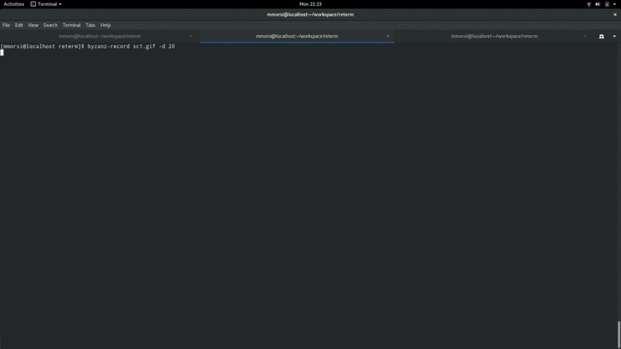

# RETerm - Ruby Enhanced Terminal

RETerm is a Text Based User Interface Framework built ontop of [ncurses](https://en.wikipedia.org/wiki/Ncurses)

## Worth a thousand words...



## Installation

RETerm depends on the **ncursesw** rubygem, which in return depends on the '[ncursesw](https://www.gnu.org/software/ncurses/)' and terminfo libraries. These must be available for use locally via on means or another. Most Operating Systems and distributions have a binary / bundled version available, read the ncurses documentation for more information. The following packages should suffice to install on Linux:

```
  $ dnf install ruby-devel ncurses-devel (Fedora/RedHat)

  $ apt-get install ruby-dev libncursesw5-dev libncurses5-dev libtinfo-dev (Ubuntu)
```

To install the core RETerm framework and components, simply run:

```
  $ gem install reterm
```

## Optional Components

RETerm ships with components that depend on additional gem dependencies. These features are completely optional and will not be required unless the corresponding components are
instantiated. To install all optional RETerm dependencies run:

```
  $ gem install artii drawille chunky_png tawny-cdk
```

## Usage

See the **examples/** directory for demos of many common components.

The following will instantiate a simple "Hello World" interface:

```ruby
require 'reterm'
include RETerm

init_reterm {
  win = Window.new :rows => 10,
                   :cols => 30
  win.border!
  update_reterm

  label = Components::Label.new :text => "Hello world"
  win.component = label
  label.draw!

  sleep(3)
}
```

For something more interesting, create and activate layout and components. After
we are done, reading the user input is a cinch!

```ruby
results = {}

init_reterm {
  win = Window.new
  win.colors = :main
  win.border!

  layout1 = Layouts::Horizontal.new
  win.component = layout1

  child1 = layout1.add_child :rows => 3,
                             :cols => 20

  dial = Components::Dial.new
  child1.component = dial

  child2 = layout1.add_child :rows => 15,
                             :cols => 40

  entry = Components::Entry.new :title => "Enter: ", :label => "Text:"
  child2.component = entry

  ###

  win.activate!

  results[:dial]   = dial.value
  results[:entry]  = entry.value
}

puts "Input results: "
puts results
```

How about a generic JSON schema representing a terminal interface?

```json
{
  "window" : {
    "rows"      : 10,
    "cols"      : 50,
    "border"    : true,
    "component" : {
      "type" : "Entry",
      "init" : {
        "title" : "<C>Demo",
        "label" : "Enter Text: "
      }
    }
  }
}
```

And here's how to load it:

```ruby
init_reterm {
  load_reterm(File.read('path/to/schema.json')).activate!
}
```

## Documentation

Full reference documentation is available via [yard](http://www.rubydoc.info/gems/reterm)

## Legaleese

Copyright (C) 2017 Mo Morsi <mo@morsi.org>

Distributed under the MIT licesnse
